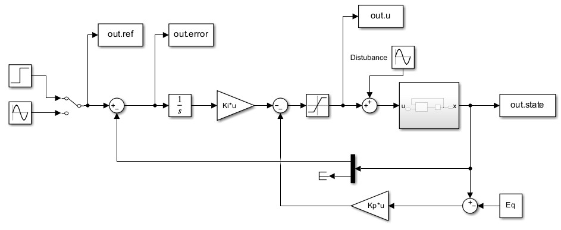

# CIMA_Reaction_Analysis_and_Control
This project presents an open-loop analysis and a control synthesis applied to the Chlorine Dioxide–Iodine–Malonic Acid (CIMA) reaction. 
The complete report is available [here](./CIMA_Reaction_ROMANO.pdf).

## Nonlinear Model of the CIMA Reaction
In 1990, Lengyel et al. proposed and analyzed a particularly elegant model of another oscillating reaction, the chlorine dioxide-iodine-malonic acid $(ClO_2-I_2-MA)$. This reaction mixture contains chlorine dioxide $(ClO_2)$, iodine $(I_2)$ and malonic acid $(MA)$. Lengyel's group demostrated how these components interact and evolve within the system.
<div align="center">
  
  <p><em>CIMA Reactions and Empirical Rate Laws</em></p>
</div>
Thanks to some semplification, the Nonlinear Model describing the CIMA Reaction is:

```math
\begin{aligned}
&\dot{x}_1 = a-x_1-\frac{4x_1x_2}{1+x_1^2} + u;
\\
&\dot{x}_2 = b \left(x_1-\frac{x_1x_2}{1+x_1^2}\right);
\end{aligned}
```
Where:
- $x_1$ is the dimensionless concentration of $I^-$ 
- $x_2$ is the dimensionless concentration of $ClO_2^-$
- $a >0$ and $b >0$ represent kinetic parameters.
- $u$ is the control input

## Open Loop Analysis 
Fixing $a= 10$ and varying parameter $b$, it is possible to see how the equilibrium point of the system changes.
### Equilibrium Point
This system has only one equilibrium point:
 ```math
\begin{aligned}
\bar{x} = \begin{bmatrix}
     \frac{a}{5} \\ 1 + \frac{a^2}{25}
\end{bmatrix} = \begin{bmatrix}
     2 \\ 5
\end{bmatrix}

\end{aligned}
```
### System Stability in PPlane
In order to classify the equilibrium point and to study its stability, three different values of b are considered:
- $b= 0.1$, where the equilibrium is an unstable node surrounding by a stable Limit Cycle.
<div align="center">
  
  <p><em>Phase Portrait of the System when b= 0.1</em></p>
</div>
- b=2, where the equilibrium is an unstable spiral surrounding by a stable Limit Cycle.
<div align="center">
  
  <p><em>Phase Portrait of the System when b= 2</em></p>
</div>
- b=5, where the equilibrium is a stable spiral. 
  <div align="center">
  
  <p><em>Phase Portrait of the System when b=5</em></p>
  </div>
  
### Bifurcation Analysis in MatCont
MatCont reveals that an Hopf bifurcation occurs at b=3.5
<div align="center">
  
  <p><em>Hopf bifurcation at b= 3.5</em></p>
</div>

## Control Synthesis 
Fixing $a= 10$ and $b=2$, the control input $u$ is introduced to regulate the concentration of iodide $(I^-)$ in the system. The objective of the control synthesis is to regulate the concentration of iodide:
```math
\begin{aligned}
y=x_1
\end{aligned}
```
with two separately input references (constant and sinusoidal) with the desired specifications. 
For this purpose, three different controllers have been implemented, one linear and two nonlinear:
### Linear LQ Optimal Control (linearized around the equilibrium point)
<div align="center">

  <p><em>Control Scheme with the LQ Optimal Controller.</em></p>
</div>

### I/O Feedback Linearization Control
<div align="center">

  <p><em>Control Scheme with the the I/O Feedback Linearization Controller.</em></p>
</div>

### Sliding Mode Control
<div align="center">

  <p><em>Control Scheme with the the Sliding Mode Controller.</em></p>
</div>

## Controller Comparison and Robustness Analysis
### Constant Input Reference $x_{1d} = 5$
<div align="center">
  
  <p><em>Controllers' Performance comparison with $x_{1d} = 5$ </em></p>
</div> 

### Sinusoidal Input Reference $x_{1d}=5+0.5sin(2t)$
<div align="center">
  
  <p><em>Controllers' Performance comparison with $x_{1d} = 5+0.5\sin(2t)$ </em></p>
</div> 

### Constant Input Reference $x_{1d} = 5$ with a input disturbance 
<div align="center">
  
  <p><em> Controllers' Performance comparison with $x_{1d} = 5$ and a disturbance applied on the input $d(t)=0.6\sin(t)$. </em></p>
</div> 

### Constant Input Reference $x_{1d} = 5$ under parametric uncertainties 20%
<div align="center">
  
  <p><em>Controllers' Performance comparison with $x_{1d} = 5$ with parametric uncertainties of 20\%. </em></p>
</div> 
