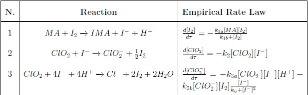

# CIMA_Reaction_-Analysis_and_Control
This project presents an open-loop analysis and a control synthesis applied to the Chlorine Dioxide–Iodine–Malonic Acid (CIMA) reaction. 
The complete report is available [here](./CIMA_Reaction_ROMANO.pdf).

## Nonlinear Model of the CIMA Reaction
In 1990, Lengyel et al. proposed and analyzed a particularly elegant model of another oscillating reaction, the chlorine dioxide-iodine-malonic acid $(ClO_2-I_2-MA)$. This reaction mixture contains chlorine dioxide $(ClO_2)$, iodine $(I_2)$ and malonic acid $(MA)$. Lengyel's group demostrated how these components interact and evolve within the system.
<div align="center">
  
  <p><em>CIMA Reactions and Empirical Rate Laws</em></p>
</div>
Thanks to some semplification, the Nonlinear Model describing the CIMA Reaction is:

```math
\begin{aligned}
&\dot{x}_1 = a-x_1-\frac{4x_1x_2}{1+x_1^2} + u;
\\
&\dot{x}_2 = b \left(x_1-\frac{x_1x_2}{1+x_1^2}\right);
\end{aligned}
```
Where:
- $x_1$ is the dimensionless concentration of $(I^-)$ 
- $x_2$ is the dimensionless concentration of $(ClO_2^-)$
- \( a >0\) and \( b >0\) represent kinetic parameters.
- u is the control input
